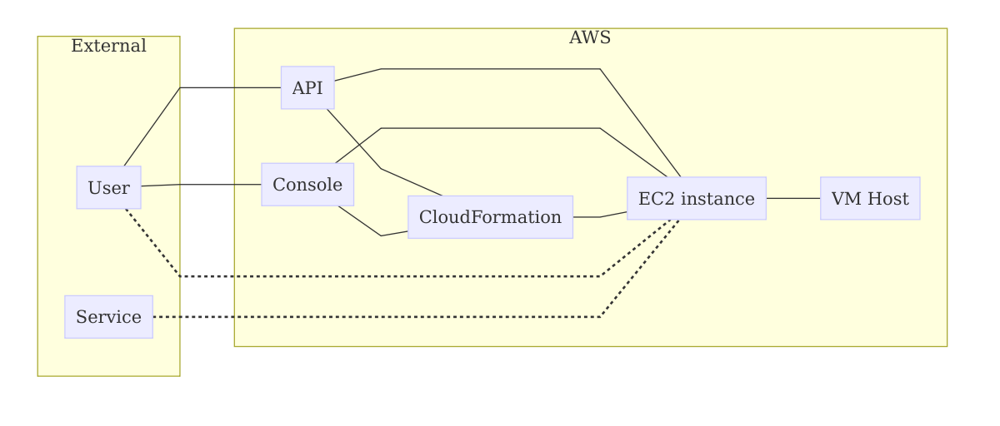
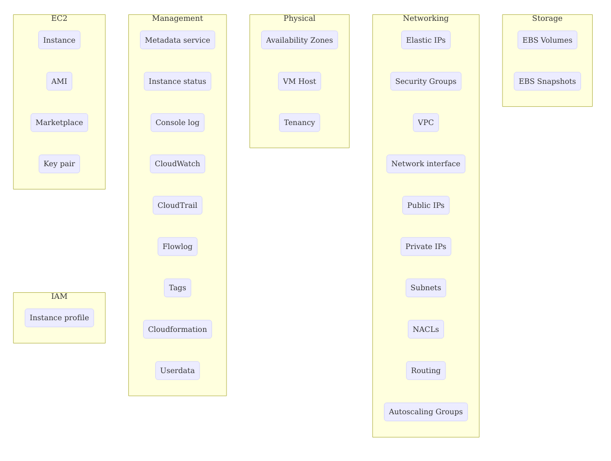

# AWS Elastic Compute Cloud (EC2)

Amazon Web Service's virtual computing service.

# See also

* http://docs.aws.amazon.com/AWSEC2/latest/UserGuide/concepts.html
* http://docs.aws.amazon.com/AWSEC2/latest/APIReference/API_Operations.html
# AWS EC2 Threat Model

# Overview

## Data flow diagram (DFD)

## Related components

# Assumptions

* A threat model exists for console and API access to service. This page does not include threat models of the TLS or authentication mechanism of the AWS API itself.
* A threat model exists for the operating system and application stacks. This page does include threat models of for example SSH access or web services that may be running on the EC2 instance.

# Notes

* Attacker can replace AMI ID during instance creation with a malicious one (Tampering)
* Attacker can replace key pair to one they control
* In a shared tenancy environment, attacker is able to escape their guest VM and influence the instance
* In a shared tenancy environment, attacker is able to read sensitive data through the VM host (e.g. CPU cache)
* Flowlog data exposes potentially sensitive metadata about connections
* Attacker is able to restore a snapshot, thereby recovering all the data that is in the snapshot
* Where instances in an AutoScaling Group have been hot-fixed, an attacker is able to revert an instance to an insecure stay using a DoS attack that causes health checks to fail, resulting in the AutoScaling Group removing the current hot-patched instance and replacing it with new un-patched ones.
* Where instances in an AutoScaling Group fail to log to a centralised service, an attacker is able to destroy the logs using a DoS attack that causes health checks to fail, resuling in the AutoScaling Group removing the current instance with all the logs, and replacing it with a new instance without logs.

# Threats

## OCST-1.1.1
### Name
User Data contains sensitive data
### Description
An attacker may be able to gain access to sensitive information if it is stored in User Data, especially if they have read access to CloudFormation. Secret data such as passwords, API or pre-shared keys should not be placed directly in UserData.

### Service
AWS EC2
### Status
Confirmed
### Stride
* Information Disclosure
### Components
* User Data
### Mitigations
* [aws/ec2/features/userdata_does_not_contain_sensitive_information.feature](https://github.com/owasp-cloud-security/owasp-cloud-security/blob/master/aws/ec2/features/userdata_does_not_contain_sensitive_information.feature)
### References
* https://docs.aws.amazon.com/AWSEC2/latest/UserGuide/user-data.html

## OCST-1.1.2
### Name
Tampering of User Data
### Service
AWS EC2
### Status
Confirmed
### Stride
* Tampering
### Components
* User Data
### Mitigations
* [Use restrictive permissions on the User Data script](https://github.com/owasp-cloud-security/owasp-cloud-security/blob/master/Use restrictive permissions on the User Data script)
### References
* https://docs.aws.amazon.com/AWSEC2/latest/UserGuide/user-data.html

## OCST-1.1.3
### Name
Metadata Server Side Request Forgery
### Description
TODO

### Service
AWS EC2
### Status
Confirmed
### Stride
* Information Disclosure
### Components
* Metadata service
### Mitigations
* [TODO](https://github.com/owasp-cloud-security/owasp-cloud-security/blob/master/TODO)
### References
* https://blog.christophetd.fr/abusing-aws-metadata-service-using-ssrf-vulnerabilities/
* https://docs.aws.amazon.com/AWSEC2/latest/UserGuide/ec2-instance-metadata.html

## OCST-1.1.4
### Name
Replacing User Data artifacts
### Description
An attacker is able to overwrite build artifacts used during instance creation resulting in arbitrary code execution due to weak protection of the artifacts.

For example, if an attacker can replace an installation package (e.g. a .deb or .rpm file) stored in S3, then when the instance pulls teh package down as part of the User Data script, it will extract and execute the package as root giving the attacker code execution.

### Service
AWS EC2
### Status
Confirmed
### Stride
* Tampering
* Elevation of Privilege
### Components
* User Data
### Mitigations
* [Ensure all external artifacts used by a User Data script are sufficiently protected](https://github.com/owasp-cloud-security/owasp-cloud-security/blob/master/Ensure all external artifacts used by a User Data script are sufficiently protected)
### References
* https://docs.aws.amazon.com/AWSEC2/latest/UserGuide/user-data.html

## OCST-1.1.5
### Name
Instance search hijack
### Description
An attacker can create a similarly named or tagged instance which is included in a search and therefore acted upon by some business logic. 

For example, the attacker creates an instance with the tag "Name:WebService" that runs a modified ssh daemon that collects usernames and passwords. When the administrator attempts to SSH to each "Name:WebService" instance, it includes the attackers instance, thereby exposing the administrator's credentials.

### Service
AWS EC2
### Status
Confirmed
### Stride
* Spoofing
### Components
* Instances
* Tagging
### Mitigations
* [Restrict the creation of new instances](https://github.com/owasp-cloud-security/owasp-cloud-security/blob/master/Restrict the creation of new instances)
* [Apply detective controls to identify rogue instances](https://github.com/owasp-cloud-security/owasp-cloud-security/blob/master/Apply detective controls to identify rogue instances)
### References
* https://docs.aws.amazon.com/AWSEC2/latest/UserGuide/EC2_GetStarted.html

## OCST-1.1.6
### Name
Security Group stacking
### Description
An attacker is able to attach security groups to running instances thereby increasing the attack surface or allowing easier exfiltration of data where outbound connectivity is restricted.

If an attacker has the ability to create or attach existing security groups with more permissive rules to an instance, they may be able to reach newly exposed services running on the instance or they may be able to use outbound connectivity previously restricted.

### Service
AWS EC2
### Status
Confirmed
### Stride
* Tampering
### Components
* Security Groups
* Instances
### Mitigations
* [Restrict the ability to create, modify and attach security groups](https://github.com/owasp-cloud-security/owasp-cloud-security/blob/master/Restrict the ability to create, modify and attach security groups)
### References
* https://docs.aws.amazon.com/AmazonVPC/latest/UserGuide/VPC_SecurityGroups.html

