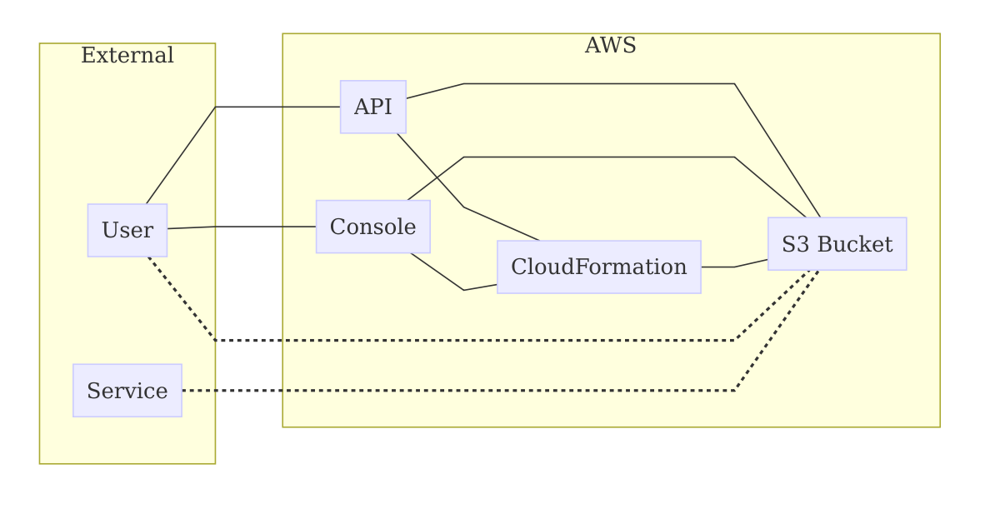
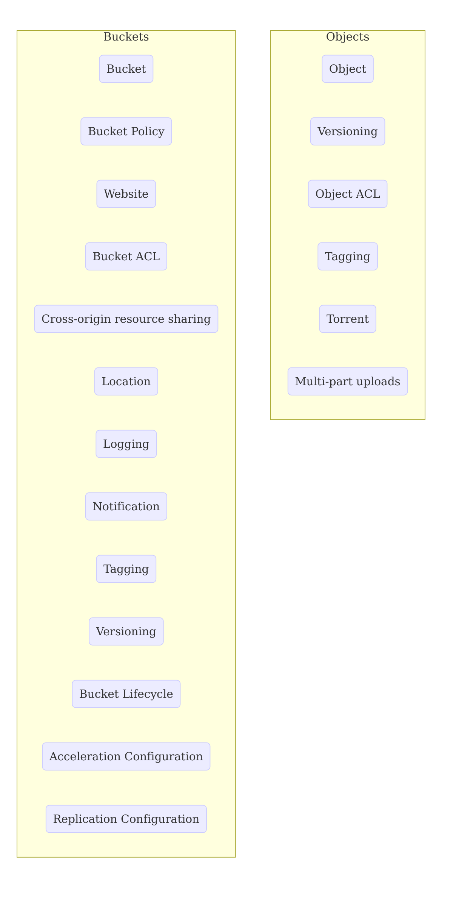

# AWS Simple Storage Service (S3)

Amazon Web Service's highly-scalable object storage.

# See also

* https://aws.amazon.com/s3/
* https://docs.aws.amazon.com/IAM/latest/UserGuide/list_s3.html
# AWS S3 Threat Model

# Overview

## Data flow diagram (DFD)

## Related components

# Assumptions

* A threat model exists for console and API access to service. This page does not include threat models of the TLS or authentication mechanism of the AWS API itself.
